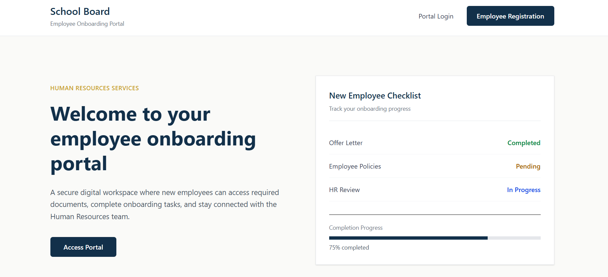
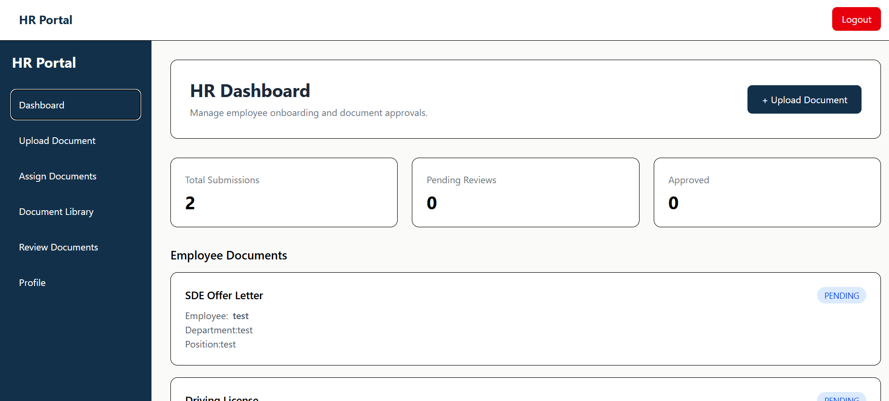
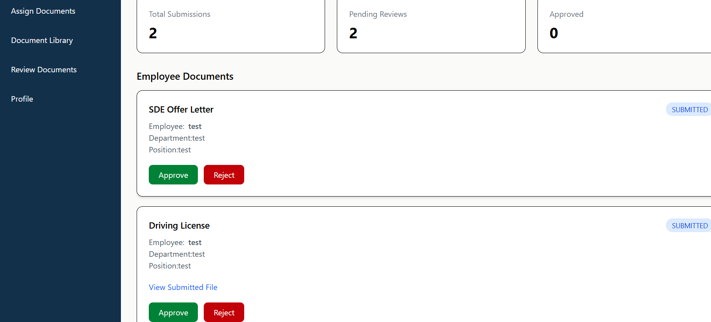
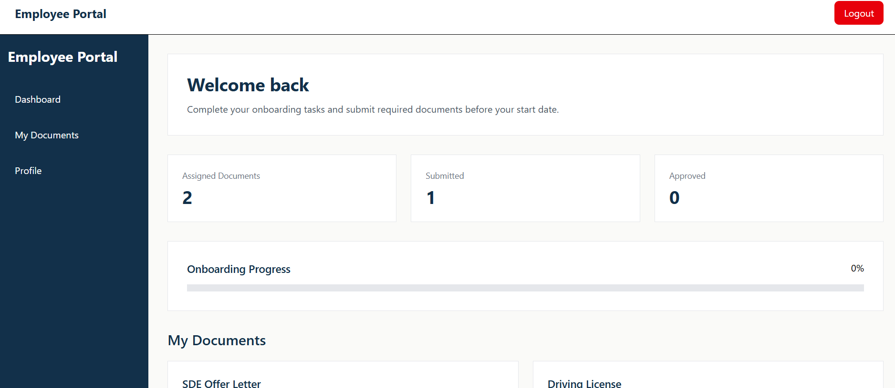
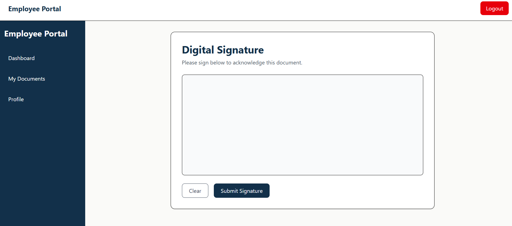

# Employee Onboarding Portal

A full-stack employee onboarding system designed to manage employee documents, onboarding tasks, and HR workflows.

## Features

- Role-based authentication (HR/Admin and Employee)
- Employee document management
- Document assignment and submission tracking
- HR approval workflow
- Employee onboarding progress tracking
- Secure PostgreSQL database integration

## Tech Stack

**Frontend**
- React
- Tailwind CSS
- Axios

**Backend**
- Django
- Django REST Framework
- PostgreSQL
- JWT Authentication

## Live Demo

Frontend:
https://employee-onboarding-gamma.vercel.app

Backend API:
https://employee-onboarding-backend-traj.onrender.com

## Repository

GitHub:
https://github.com/roshan13ghimire/Employee-Onboarding

## Demo Accounts

HR/Admin:
- Username: admin
- Password: admin

## Future Improvements

- Email verification and notifications
- Advanced role permissions
- Training completion tracking
- Improved document workflows

## Screenshots

### Home Page

### HR Dashboard

### Employee Dashboard

### Digital Signature

